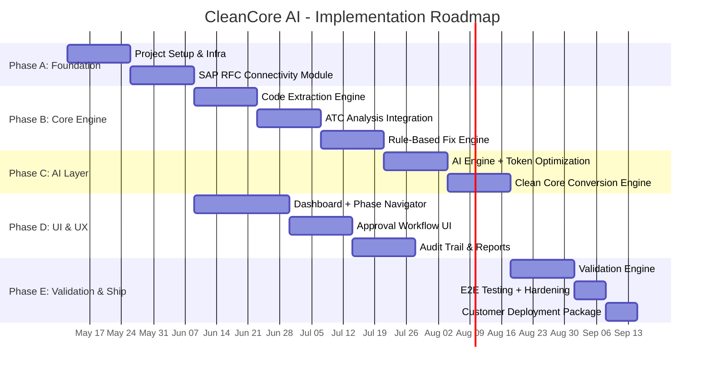

# CleanCore AI — Implementation Roadmap & Plan

---

## 1. Implementation Phases (20 Weeks Total)



---

## 2. Sprint-Level Breakdown

### Phase A: Foundation (Weeks 1-4)

#### Sprint 1-2: Project Setup & Infrastructure
- [ ] Initialize monorepo (NestJS backend + React frontend)
- [ ] Docker Compose setup (PostgreSQL, Redis, MinIO)
- [ ] Prisma schema + migrations for core tables
- [ ] Authentication (Keycloak integration)
- [ ] API gateway + CORS + rate limiting
- [ ] WebSocket server for real-time updates
- [ ] Logging framework (Winston + structured JSON)
- [ ] Environment config management (dotenv + Vault)

#### Sprint 3-4: SAP RFC Connectivity
- [ ] node-rfc wrapper service with connection pooling
- [ ] RFC connection manager (create, test, store connections)
- [ ] System discovery APIs (RFC_SYSTEM_INFO, etc.)
- [ ] ABAP transport package (Z_CLEANCORE_CONNECTOR)
- [ ] Custom RFMs: ZFM_CC_GET_CUSTOM_OBJECTS, ZFM_CC_READ_SOURCE
- [ ] Connection health monitoring + auto-reconnect
- [ ] Encrypted credential storage (AES-256)

### Phase B: Core Engine (Weeks 5-10)

#### Sprint 5-6: Code Extraction Engine
- [ ] Batch code extraction via RFC (programs, FMs, classes, includes)
- [ ] TADIR/TRDIR scanning for Z*/Y* objects
- [ ] Source code storage with SHA-256 hashing
- [ ] Dependency graph builder (WHERE-USED analysis)
- [ ] SCMON usage data extraction + processing
- [ ] Progress tracking for extraction jobs
- [ ] Incremental extraction (delta sync)

#### Sprint 7-8: ATC Analysis Integration
- [ ] Remote ATC check system integration
- [ ] Simplification DB mapping engine
- [ ] ATC findings parser + priority classifier (P1/P2/P3)
- [ ] Obsolete table detector with replacement mapping
- [ ] SELECT statement analyzer (missing ORDER BY, etc.)
- [ ] MATNR/BP length issue detector
- [ ] Cluster/pooled table usage finder (KONV, BSEG, etc.)
- [ ] Findings dashboard API

#### Sprint 9-10: Rule-Based Fix Engine
- [ ] Rule catalog JSON structure + loader
- [ ] 200+ pre-built rules:
  - Obsolete table → CDS view replacements
  - SELECT * → explicit field list
  - Missing ORDER BY additions
  - MATNR 18→40 character adaptations
  - Cluster table (KONV→PRCD_ELEMENTS, BSEG→ACDOCA)
  - MOVE-CORRESPONDING fixes
  - Obsolete statement replacements
- [ ] Diff generator (before/after with context)
- [ ] Fix confidence scoring
- [ ] Developer approval queue API

### Phase C: AI Layer (Weeks 11-14)

#### Sprint 11-12: AI Engine + Token Optimization
- [ ] LLM integration adapter (OpenAI, Claude, SAP AI Core, Ollama)
- [ ] Model router (simple→local, complex→cloud)
- [ ] Prompt template library for ABAP transforms
- [ ] Semantic cache (Redis + vector embeddings)
- [ ] Context compactor (extract only relevant code sections)
- [ ] Batch prompt processor
- [ ] Token usage tracker + cost calculator
- [ ] Fallback chain (local → cloud → manual)

#### Sprint 13-14: Clean Core Conversion Engine
- [ ] Pattern detector: BDC recordings, ALV reports, Module Pools
- [ ] BDC → BAPI/API conversion:
  - Extract BDC field mappings
  - Map to corresponding BAPI/API parameters
  - Generate wrapper function module
- [ ] ALV → RAP conversion:
  - Extract ALV field catalog + data source
  - Generate CDS view from SELECT logic
  - Generate metadata extension
  - Generate service definition + binding
- [ ] Module Pool → Fiori conversion:
  - Analyze screen flow + PAI/PBO modules
  - Generate RAP Behavior Definition
  - Generate Fiori Elements annotations
- [ ] Conversion preview + developer approval

### Phase D: UI & UX (Weeks 5-11, parallel)

#### Sprint 5-7: Dashboard + Phase Navigator
- [ ] SAP Fiori Horizon design system setup
- [ ] Project creation wizard
- [ ] Connection configuration panel
- [ ] 6-phase navigator (SUM-inspired stepper)
- [ ] Real-time progress bars per phase
- [ ] Object inventory explorer
- [ ] Findings overview with filtering/sorting

#### Sprint 8-9: Approval Workflow UI
- [ ] Fix queue with diff viewer (Monaco Editor)
- [ ] Side-by-side code comparison
- [ ] Approve/Reject/Modify actions
- [ ] Bulk operations (approve all P3 rule-based fixes)
- [ ] Comment/annotation on fixes
- [ ] Role-based access (Developer, Approver, Admin)

#### Sprint 10-11: Audit Trail & Reports
- [ ] Immutable audit log viewer
- [ ] Filter by phase, object, user, action
- [ ] Export: PDF report, Excel, JSON
- [ ] Clean Core Index dashboard
- [ ] Executive summary generator
- [ ] Migration progress charts (objects fixed over time)

### Phase E: Validation & Ship (Weeks 15-20)

#### Sprint 15-16: Validation Engine
- [ ] Version comparator (original vs. fixed code)
- [ ] ATC re-run on fixed objects
- [ ] Syntax check API integration
- [ ] Output comparison framework
- [ ] Clean Core compliance scorer
- [ ] Validation report generator

#### Sprint 17-19: E2E Testing + Hardening
- [ ] End-to-end test with sample ECC system
- [ ] Performance testing (5,000+ object extraction)
- [ ] Security audit (credential encryption, API auth)
- [ ] Error handling + recovery mechanisms
- [ ] Documentation (user guide, admin guide, API docs)

#### Sprint 20: Deployment Package
- [ ] Helm chart for Kubernetes deployment
- [ ] Docker Compose for standalone deployment
- [ ] Installer script (one-command setup)
- [ ] Customer onboarding guide
- [ ] License management module

---

## 3. Project Folder Structure

```
cleancore-ai/
├── docker-compose.yml
├── docker-compose.prod.yml
├── helm/                        # Kubernetes Helm charts
│   ├── Chart.yaml
│   ├── values.yaml
│   └── templates/
├── packages/
│   ├── frontend/                # React + SAP UI5 Web Components
│   │   ├── src/
│   │   │   ├── components/
│   │   │   │   ├── Dashboard/
│   │   │   │   ├── PhaseNavigator/
│   │   │   │   ├── CodeDiffViewer/
│   │   │   │   ├── ApprovalQueue/
│   │   │   │   ├── AuditLog/
│   │   │   │   └── ProgressTracker/
│   │   │   ├── pages/
│   │   │   ├── hooks/
│   │   │   ├── services/
│   │   │   └── styles/
│   │   ├── package.json
│   │   └── vite.config.ts
│   ├── backend/                 # NestJS API Server
│   │   ├── src/
│   │   │   ├── modules/
│   │   │   │   ├── auth/
│   │   │   │   ├── projects/
│   │   │   │   ├── sap-connector/
│   │   │   │   ├── code-extractor/
│   │   │   │   ├── analyzer/
│   │   │   │   ├── rule-engine/
│   │   │   │   ├── ai-engine/
│   │   │   │   ├── conversion/
│   │   │   │   ├── validation/
│   │   │   │   ├── approval/
│   │   │   │   ├── audit/
│   │   │   │   └── progress/
│   │   │   ├── common/
│   │   │   │   ├── guards/
│   │   │   │   ├── interceptors/
│   │   │   │   └── decorators/
│   │   │   └── config/
│   │   ├── prisma/
│   │   │   └── schema.prisma
│   │   └── package.json
│   ├── worker/                  # BullMQ Job Workers
│   │   ├── src/
│   │   │   ├── jobs/
│   │   │   │   ├── extract-code.job.ts
│   │   │   │   ├── run-atc.job.ts
│   │   │   │   ├── apply-rules.job.ts
│   │   │   │   ├── ai-transform.job.ts
│   │   │   │   └── validate.job.ts
│   │   │   └── processors/
│   │   └── package.json
│   └── rfc-bridge/              # Node-RFC Sidecar
│       ├── src/
│       │   ├── connector.ts
│       │   ├── pool.ts
│       │   └── rfm-catalog.ts
│       └── package.json
├── abap/                        # ABAP Transport Package
│   ├── Z_CLEANCORE_CONNECTOR/
│   │   ├── ZCL_CC_CODE_EXTRACTOR.abap
│   │   ├── ZCL_CC_ATC_BRIDGE.abap
│   │   ├── ZFM_CC_GET_CUSTOM_OBJECTS.abap
│   │   ├── ZFM_CC_READ_SOURCE.abap
│   │   └── ZFM_CC_APPLY_FIX.abap
│   └── transport/
│       └── K900001.SAP          # Transport file
├── rules/                       # Rule Catalog
│   ├── obsolete-tables.json
│   ├── select-fixes.json
│   ├── data-type-fixes.json
│   ├── cluster-tables.json
│   └── syntax-modernization.json
├── prompts/                     # LLM Prompt Templates
│   ├── bdc-to-bapi.md
│   ├── alv-to-rap.md
│   ├── modpool-to-fiori.md
│   └── complex-refactor.md
├── docs/
│   ├── user-guide.md
│   ├── admin-guide.md
│   ├── api-reference.md
│   └── deployment-guide.md
└── tests/
    ├── e2e/
    ├── integration/
    └── unit/
```

---

## 4. Key API Endpoints

```
# Project Management
POST   /api/v1/projects                    Create migration project
GET    /api/v1/projects/:id                Get project details
GET    /api/v1/projects/:id/dashboard      Get project dashboard

# SAP Connectivity
POST   /api/v1/projects/:id/connections    Configure SAP connection
POST   /api/v1/connections/:id/test        Test RFC connection

# Phase 1: Extract
POST   /api/v1/projects/:id/extract        Start code extraction
GET    /api/v1/projects/:id/objects         List extracted objects

# Phase 2: Analyze
POST   /api/v1/projects/:id/analyze        Start ATC analysis
GET    /api/v1/projects/:id/findings        List ATC findings
GET    /api/v1/projects/:id/findings/stats  Finding statistics

# Phase 3: Auto-Fix
POST   /api/v1/projects/:id/generate-fixes  Generate fixes
GET    /api/v1/projects/:id/fixes           List all fixes
GET    /api/v1/fixes/:id/diff               Get fix diff view

# Phase 3 & 4: Approval
POST   /api/v1/fixes/:id/approve            Approve fix
POST   /api/v1/fixes/:id/reject             Reject fix
POST   /api/v1/fixes/:id/modify             Modify and approve
POST   /api/v1/fixes/bulk-approve           Bulk approve

# Phase 4: Clean Core Conversion
POST   /api/v1/projects/:id/convert         Start conversion
GET    /api/v1/conversions/:id/artifacts     Get generated artifacts

# Phase 5: Validate
POST   /api/v1/projects/:id/validate        Run validation
GET    /api/v1/projects/:id/validation-report Get report

# Phase 6: Audit
GET    /api/v1/projects/:id/audit-log        Get audit trail
GET    /api/v1/projects/:id/audit-log/export Export (PDF/Excel)

# Progress (WebSocket)
WS     /ws/projects/:id/progress             Live progress updates
```

---

## 5. Clean Core Conversion Patterns

### 5.1 BDC → BAPI/API

```
INPUT: BDC Recording Program
┌─────────────────────────────────────┐
│ CALL TRANSACTION 'VA01' USING       │
│   bdcdata                           │
│   MODE 'N'                          │
│   UPDATE 'S'.                       │
│                                     │
│ → Screen 100: VBAK-AUART = 'OR'    │
│ → Screen 200: VBAP-MATNR = '...'   │
│ → Screen 200: VBAP-KWMENG = 10     │
└─────────────────────────────────────┘
                 │
                 ▼ CleanCore AI converts to:
┌─────────────────────────────────────┐
│ CALL FUNCTION 'BAPI_SALESORDER_     │
│   CREATEFROMDAT2'                   │
│   EXPORTING                         │
│     order_header_in = ls_header     │
│   TABLES                            │
│     order_items_in  = lt_items      │
│     order_partners  = lt_partners   │
│     return          = lt_return.    │
│                                     │
│ CALL FUNCTION 'BAPI_TRANSACTION_    │
│   COMMIT'.                          │
└─────────────────────────────────────┘
```

### 5.2 ALV → RAP + Fiori Elements

```
INPUT: Classic ALV Report
┌──────────────────────────────────┐
│ SELECT * FROM VBAK/VBAP          │
│ → Build field catalog            │
│ → REUSE_ALV_GRID_DISPLAY         │
└──────────────────────────────────┘
                │
                ▼ CleanCore AI generates:
┌──────────────────────────────────┐
│ 1. CDS View:                     │
│    define view ZI_SalesOrders    │
│    2. Metadata Extension         │
│    3. Service Definition         │
│    4. Service Binding (OData V4) │
│    → Fiori Elements List Report  │
└──────────────────────────────────┘
```

### 5.3 Module Pool → RAP BO + Fiori

```
INPUT: Module Pool (SAPMZ_ORDER)
┌──────────────────────────────────┐
│ Screen 100: Selection screen     │
│ Screen 200: Detail view          │
│ Screen 300: Edit mode            │
│ PAI/PBO modules with DB logic    │
└──────────────────────────────────┘
                │
                ▼ CleanCore AI generates:
┌──────────────────────────────────┐
│ 1. CDS Entity (root + child)    │
│ 2. Behavior Definition (managed)│
│ 3. Behavior Implementation      │
│ 4. Service Definition           │
│ 5. Service Binding              │
│ 6. Fiori Elements Object Page   │
└──────────────────────────────────┘
```

---

## 6. Customer Deployment Guide

### 6.1 One-Command Deployment

```bash
# Option A: Docker Compose (Standalone)
curl -sSL https://cleancore.ai/install.sh | bash
# → Downloads docker-compose.yml
# → Pulls containers
# → Starts stack on port 8443

# Option B: Kubernetes (Enterprise)
helm repo add cleancore https://charts.cleancore.ai
helm install cleancore cleancore/cleancore-ai \
  --set global.domain=cleancore.customer.com \
  --set ai.provider=azure-openai \
  --set ai.apiKey=$AZURE_KEY
```

### 6.2 Prerequisites at Customer Site

| Requirement | Detail |
|---|---|
| **Infrastructure** | Docker host (8GB RAM, 4 vCPU, 100GB disk) or K8s cluster |
| **SAP NW RFC SDK** | Downloaded from SAP Support Portal (S-user required) |
| **Network** | TCP connectivity to SAP ECC (ports 33xx for RFC) |
| **SAP User** | RFC-type user with authorizations: S_RFC, S_DEVELOP, S_TRANSPRT |
| **ABAP Package** | Z_CLEANCORE_CONNECTOR transported to source ECC |
| **LLM API** (optional) | API key for chosen LLM provider; or Ollama for air-gapped |

### 6.3 Air-Gapped Deployment (No Internet)

For high-security customers with no external connectivity:
- Use **Ollama** with local models (CodeLlama-34B or DeepSeek-Coder-33B)
- Pre-package all Docker images as tar archives
- Rule engine (Tier 1) handles 80% of fixes with zero external calls
- Template engine (Tier 2) handles 15% with local model
- Remaining 5% flagged for manual developer review

---

## 7. Security Architecture

| Layer | Measure |
|---|---|
| **Transport** | TLS 1.3 for all APIs; SNC for RFC connections |
| **Authentication** | SAML 2.0 / OAuth 2.0 via Keycloak or SAP IAS |
| **Authorization** | RBAC: Admin, Architect, Developer, Reviewer, Auditor |
| **Credentials** | AES-256 encrypted at rest; HashiCorp Vault integration |
| **Audit** | Immutable append-only log; tamper-evident checksums |
| **Data** | All code stays on-premise; LLM calls send only code snippets (no PII) |
| **Network** | Deploys within customer DMZ; no inbound internet required |

---

## 8. Key Risks & Mitigations

| Risk | Impact | Mitigation |
|---|---|---|
| RFC SDK licensing | Blocks connectivity | Verify S-user access early; fall back to OData |
| AI hallucinations | Incorrect code fixes | Rule engine as primary; AI fixes always require approval |
| Large code base (>10K objects) | Performance | Batch processing; incremental extraction; worker scaling |
| Complex BDC programs | Low conversion accuracy | Flag for manual conversion; provide scaffolding only |
| Customer network restrictions | Connectivity issues | SAP Cloud Connector support; air-gapped mode |
| LLM cost overrun | Budget impact | 3-tier model; token budgets per project; alerts |
